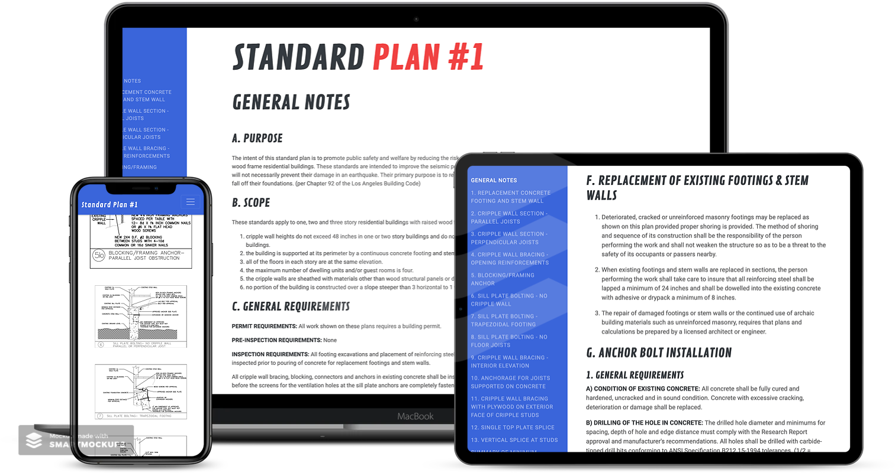

# Boltdown
[www.boltdown.jacksonwfoster.com](http://www.boltdown.jacksonwfoster.com)

The idea for this project came to me when I very first started working for The Foundation Works. 
A substantial amount of The Foundation Works jobs are seismic retrofits i.e. bolting down houses for earthquakes. The City of Los Angeles provides a standardized engineering plan for homes that meet certain criteria, called Standard Plan #1. These plans come on either a 4’x2′ piece of paper, or a **massive** PDF file.

Pulling out and navigating the Standard Plan was always a pain in the neck so I created this website that makes it easily accessible and it is frequently used throughout The Foundation Works. Additionally, in order to get raises, employees are tested on their knowledge of the Standard Plan. This website has served as a valuable resource for on boarding and advancing new employees within The Foundation Works.

Out of all the apps I made while at The Foundation Works, this app is one of the most used and has proven to be very valuable to the employees, regardless of their experience.

